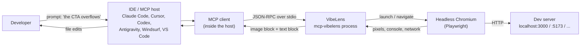
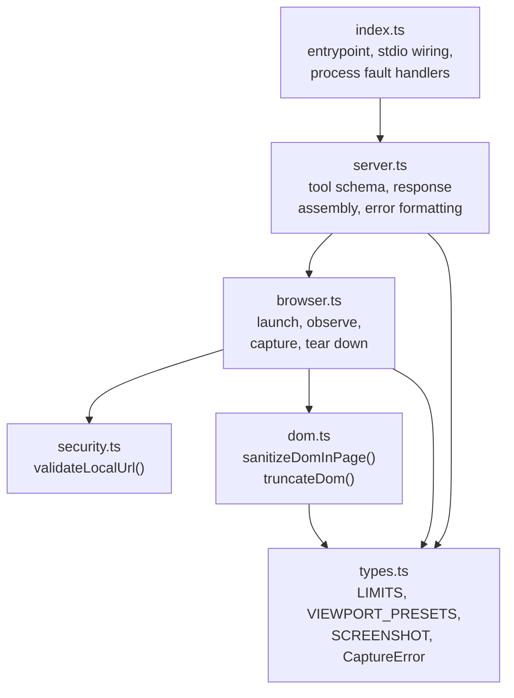
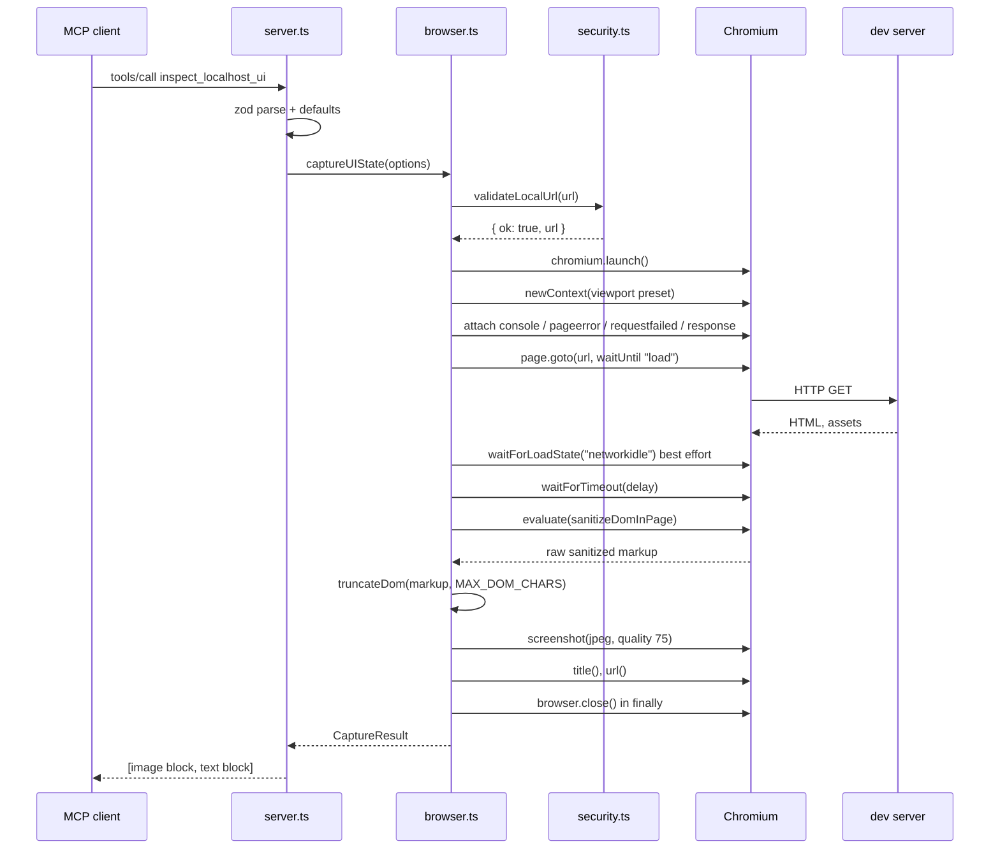
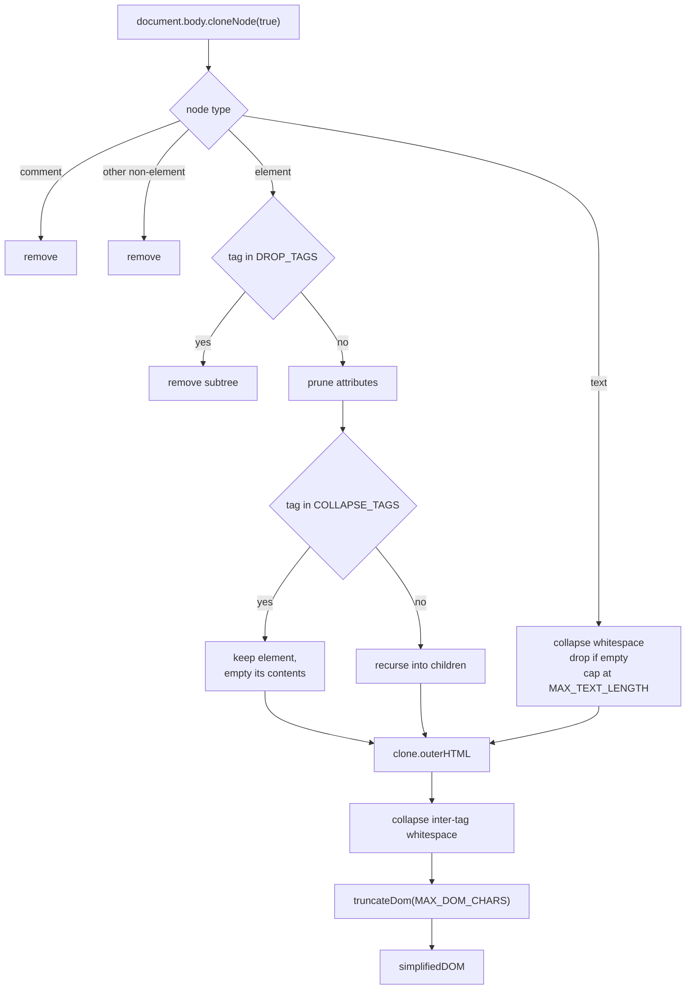
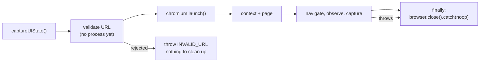

# VibeLens Architecture

This document describes how VibeLens is built and why the boundaries are drawn
where they are. Every statement here is traceable to a file in `src/`; where a
number appears it comes from `src/types.ts` unless stated otherwise.

- [1. The problem](#1-the-problem)
- [2. System context](#2-system-context)
- [3. Modules](#3-modules)
- [4. Lifecycle of one call](#4-lifecycle-of-one-inspect_localhost_ui-call)
- [5. DOM sanitization pipeline](#5-dom-sanitization-pipeline)
- [6. Error taxonomy](#6-error-taxonomy)
- [7. Resource model](#7-resource-model)
- [8. Token budget](#8-token-budget)
- [9. Extension points](#9-extension-points)

---

## 1. The problem

An AI coding assistant can write a page but cannot see the render. The developer
becomes the framebuffer: they look at `localhost:3000`, describe the defect in
prose, and the model guesses which selector is responsible. Two failure modes
dominate:

- **Invisible errors.** A hydration mismatch or a 404 hero image appears in the
  browser console, not in the developer's description.
- **Selector hallucination.** The model edits `.btn-primary` because that is
  what it wrote earlier, while the element actually carries `.cta-button`.

A screenshot alone fixes neither. A DOM dump alone fixes neither, and costs an
enormous amount of context. VibeLens exists to return all three signals —
pixels, diagnostics, and a *sanitized* element tree — in one tool call, cheaply
enough that the model can call it again to verify its own fix.

The architectural consequences of that goal are the whole design:

| Goal | Consequence in the code |
| --- | --- |
| One call must be enough | A single tool, three signals in one response (`src/server.ts`). |
| Calls must be repeatable in one session | JPEG screenshots and the `LIMITS` budget (`src/types.ts`). |
| It runs on a developer's machine | Ephemeral browser, `finally`-close (`src/browser.ts`). |
| The URL comes from a model | Allowlist validation before launch (`src/security.ts`). |
| Failure must not end the session | `CaptureError` with a `hint`, `isError: true` responses. |

---

## 2. System context

VibeLens is a local stdio process. It never listens on a socket, and it never
reaches the public internet.

Trust boundaries, from most to least trusted:

1. **The host and its MCP client** — trusted transport peer. It supplies tool
   arguments that originate from a model, so the arguments themselves are not
   trusted.
2. **VibeLens** — trusted code, running with the developer's privileges. This is
   why the SSRF gate lives here and not in the host.
3. **Chromium** — trusted binary, untrusted content. It is given only URLs that
   already passed validation.
4. **The rendered page** — fully untrusted data. Its text may contain prompt
   injection aimed at the calling assistant, so the DOM snapshot is data, never
   instruction. This is a documented residual risk, not something code can fix.

Two properties fall out of the diagram:

- There is no network server to attack. The only input channel is stdio from the
  host process.
- The dev server is reached *through* Chromium, so VibeLens never needs an HTTP
  client of its own.

---

## 3. Modules

Dependencies point one way only: entrypoint to server to engine to leaf modules.
`security.ts` and `dom.ts` import nothing from the rest of the project except
types, so both are unit-testable without a browser or a protocol client.

### `src/index.ts` — entrypoint

Roughly thirty lines. It installs `uncaughtException` and `unhandledRejection`
handlers that log and continue, creates the server, connects it to
`StdioServerTransport`, and logs readiness.

*Why the boundary exists:* connecting to stdio is a side effect. Keeping it out
of `server.ts` means `createServer()` can be imported by tests and driven over
`InMemoryTransport` with no process-level effects. The fault handlers live here
because they are process concerns, not server concerns: an MCP server that exits
mid-session forces the user to restart their IDE integration.

### `src/server.ts` — protocol surface

Owns the tool name (`inspect_localhost_ui`), its description, its zod
`inputSchema`, the `readOnlyHint` / `openWorldHint` annotations, and the two
builders `buildTextPayload()` and `buildErrorPayload()`. It also exports `log()`,
the only sanctioned logging path, which writes to **stderr**.

*Why the boundary exists:* this module is where the model-facing contract lives.
The schema descriptions, the tool description, and the error prose are all
written for a model to read, and they change for product reasons, not for
browser reasons. Separating them from `browser.ts` means a change to how a
failure is phrased cannot touch capture logic. `buildTextPayload` and
`buildErrorPayload` are exported as pure functions precisely so their wording is
testable.

The handler's contract is narrow: call `captureUIState()`, and on any throw
return `{ isError: true, content: [text] }`. It never rethrows.

### `src/browser.ts` — capture engine

The only module that knows Playwright exists. It exports one function,
`captureUIState(options)`, and holds four private helpers: `normalizeDelay()`,
`toCaptureError()`, `launchBrowser()` and `formatConsoleMessage()`.

*Why the boundary exists:* Playwright is the single heaviest dependency and the
single most likely thing to be swapped or upgraded. Containing it behind one
function with a plain-data return type (`CaptureResult`) means the protocol layer
has no browser-shaped types in it. It is also where the resource invariant is
enforced — one `try/finally` in one place is auditable; cleanup scattered across
modules is not.

`toCaptureError()` is the translation layer between Chromium's error strings
(`ERR_CONNECTION_REFUSED`, `ERR_UNSAFE_PORT`, ...) and the taxonomy in section 6.
It exists so that no raw Chromium message ever reaches the model unclassified.

### `src/security.ts` — SSRF guard

Exports `validateLocalUrl()` plus the two predicates it is built from,
`parseIPv4()` and `isPrivateIPv4()` / `isPrivateIPv6()`. It returns a
discriminated union — `{ ok: true, url }` or `{ ok: false, reason }` — and never
throws.

*Why the boundary exists:* this is the security-critical code, and it is pure.
No I/O, no browser, no protocol. That property is what makes the table-driven
test suite possible, and the tests are the actual control: the module is small
enough to review line by line, and every allow/block decision has a case.

It is deliberately *not* called from `server.ts`. Putting the gate at the top of
`captureUIState()` means there is no path to a browser launch that skips it, even
if another caller appears later.

### `src/dom.ts` — sanitizer

Two functions with very different execution environments.
`sanitizeDomInPage(opts)` is serialized by Playwright and executed inside the
page; `truncateDom(html, maxChars)` runs in Node.

*Why the boundary exists:* the split is forced by Playwright, which serializes
the callback with `Function.prototype.toString()`. `sanitizeDomInPage` therefore
cannot reference imports or module scope — its budgets arrive through its single
argument. Keeping it in its own module, with that constraint documented at the
top of the file, prevents a well-meaning refactor from hoisting a shared
constant into it and breaking capture at runtime rather than at compile time.

`truncateDom` stays in Node because the final cap must hold even if the in-page
code is somehow bypassed or a page is pathological. It is defence in depth on
the token budget, and it is trivially unit-testable.

### `src/types.ts` — shared vocabulary

`ViewportName`, `VIEWPORT_PRESETS`, `LIMITS`, `SCREENSHOT`, `CaptureOptions`,
`CaptureResult`, `CaptureMeta`, `ConsoleEntry`, `FailedRequest`,
`DomSanitizeOptions`, `CaptureErrorCode` and the `CaptureError` class.

*Why the boundary exists:* every tunable that affects the caller's context
window is in one `as const` object. A reviewer can see the entire cost model of
the tool by reading forty lines. It also breaks what would otherwise be a
dependency cycle: `server.ts` needs `CaptureResult`, `browser.ts` needs `LIMITS`,
`dom.ts` needs `DomSanitizeOptions`.

---

## 4. Lifecycle of one `inspect_localhost_ui` call

Numbered, as the code executes:

1. **Schema validation.** The MCP SDK parses arguments against the zod schema in
   `server.ts`. `viewport` defaults to `desktop`, `delay` to `1000`, `fullPage`
   to `false`. `delay` outside 0–`MAX_DELAY_MS` is rejected at this layer;
   malformed arguments never reach the engine.
2. **Log the call.** `log()` writes the arguments to stderr. Not stdout — see
   section 7.
3. **Security gate.** `captureUIState()` calls `validateLocalUrl()` as its first
   statement. A rejection throws `CaptureError("INVALID_URL", ...)` before any
   process is spawned, so a hostile URL costs nothing.
4. **Resolve options.** The validated URL is re-serialized from the parsed `URL`
   (canonicalized, so `0177.0.0.1` has already become `127.0.0.1`), the viewport
   preset is looked up with a `desktop` fallback, and `normalizeDelay()` clamps
   the delay a second time in Node.
5. **Launch.** `launchBrowser()` starts headless Chromium with
   `--disable-dev-shm-usage` (small `/dev/shm` in containers crashes Chromium)
   and `--hide-scrollbars`, under `LAUNCH_TIMEOUT_MS`. A missing browser binary
   is mapped to `BROWSER_NOT_INSTALLED`; anything else to
   `BROWSER_LAUNCH_FAILED`.
6. **Create the context.** Viewport width/height, `deviceScaleFactor`,
   `isMobile` and `hasTouch` come from the preset. `locale` is pinned to `en-US`
   and `timezoneId` to `UTC` so two captures of the same page are comparable.
7. **Attach observers, then navigate — in that order.** `console` (errors and
   warnings only; `console.log` is dropped as noise), `pageerror`,
   `requestfailed`, and `response` for status >= 400. Attaching after navigation
   would silently miss the errors that fire during load, which are exactly the
   interesting ones.
8. **Navigate** with `waitUntil: "load"` under `NAVIGATION_TIMEOUT_MS`. A throw
   here goes through `toCaptureError()`.
9. **Settle.** `waitForLoadState("networkidle")` with a 5 s cap, wrapped in
   `.catch(() => undefined)`. Best effort by design: an app with a websocket or
   long-poll never reaches networkidle, and that must not fail the capture.
10. **Delay.** `waitForTimeout(delayMs)` if non-zero — the model's explicit
    budget for hydration, animation or data fetching.
11. **Extract the DOM.** `page.evaluate(sanitizeDomInPage, { maxTextLength,
    maxAttrLength })`, then `truncateDom()` in Node.
12. **Screenshot.** JPEG, quality 75, `fullPage` as requested.
13. **Metadata.** `page.title()` (with a `""` fallback) and `page.url()`, so the
    model can see whether it was redirected.
14. **Tear down.** The `finally` block closes the browser, itself wrapped in
    `.catch(() => undefined)` so a close failure cannot mask the real error.
15. **Assemble the response.** Image block first — the model's vision pass
    anchors on it — then the text block from `buildTextPayload()`, whose
    `simplifiedDOM` field is last because it is the largest and therefore the
    first casualty of any client-side truncation.
16. **On failure instead:** `buildErrorPayload()` produces `code`, `Problem:`
    and `Next step:` lines, returned with `isError: true`. The process stays up.

---

## 5. DOM sanitization pipeline

Raw `document.body.outerHTML` from a framework app is mostly noise: inline
scripts, injected style blobs, base64 images, SVG path data. The sanitizer runs
in the page, on a *clone* of `<body>`, so the live page is never mutated — the
tool stays read-only in fact as well as in annotation.

Stage by stage:

1. **Clone.** If there is no `<body>`, return `<!-- no <body> found -->`.
2. **Drop entirely** (`DROP_TAGS`): `SCRIPT`, `STYLE`, `NOSCRIPT`, `TEMPLATE`,
   `LINK`, `META`, `BASE`, `TITLE`. None of these carry layout signal for the
   model.
3. **Collapse to an empty box** (`COLLAPSE_TAGS`): `SVG`, `CANVAS`, `IFRAME`,
   `OBJECT`, `EMBED`, `VIDEO`, `AUDIO`, `MAP`, `PICTURE`. The element stays
   because it occupies space and affects layout; its internals are discarded
   because an SVG path is thousands of characters of nothing useful.
4. **Attribute allowlist** (`KEEP_ATTRS`): `id`, `class`, `role`, `type`, `name`,
   `alt`, `title`, `placeholder`, `href`, `src`, `value`, `for`, `label`,
   `hidden`, `disabled`, `checked`, `selected`, `readonly`, `required`, `open`,
   `colspan`, `rowspan`, `width`, `height`, `style`. Plus prefix matches
   (`KEEP_PREFIXES`): `aria-`, `data-testid`, `data-test`, `data-cy`, `data-qa`.
   Everything else is removed — framework bookkeeping attributes are the bulk of
   a modern DOM's attribute weight.
5. **Attribute value cleaning.** A value starting with `data:` becomes
   `data:<mime>[stripped]`, keeping the fact of an inline asset without its
   payload. `style` longer than 120 characters is cut (long inline styles are
   generated, not authored). Everything else is capped at `MAX_ATTR_LENGTH`.
   Truncation is marked with `…[truncated]` so the model knows the value is
   partial.
6. **Text nodes.** Whitespace collapsed to single spaces, empty nodes removed,
   each node capped at `MAX_TEXT_LENGTH`.
7. **Serialize and compress.** `outerHTML`, then `>\s+<` collapsed to `><` and
   runs of spaces/tabs squeezed.
8. **Hard cap in Node.** `truncateDom()` cuts at `MAX_DOM_CHARS` and appends
   `<!-- VibeLens: DOM truncated at N characters (original M). -->`. The marker
   is in-band on purpose: a model that can see the tree is partial narrows its
   next request instead of reasoning about markup that was never sent.
   `summary.domTruncated` reports the same fact in the structured payload.

Measured against the test fixture, a ~10 KB page reduces to ~680 characters with
every Tailwind class intact. That ratio is the entire reason the tool can be
called repeatedly inside one conversation.

What survives is deliberately what a layout fix needs: the element tree, ids,
classes, ARIA and role, form and table structure, test hooks, and short text.

---

## 6. Error taxonomy

`CaptureError` carries three things: a machine-readable `code`, a `message`
saying what happened, and a `hint` saying what to do next. `buildErrorPayload()`
renders all three. The contract is that no error reaches the model without a
next step.

| Code | Raised by | Cause | Hint given to the model |
| --- | --- | --- | --- |
| `INVALID_URL` | `captureUIState`, from `validateLocalUrl` | Not a local address: public host or IP, a DNS name, a metadata endpoint, a non-HTTP scheme, embedded credentials, or unparseable input. | Pass a localhost URL such as `http://localhost:3000`; the restriction exists to prevent SSRF. |
| `CONNECTION_REFUSED` | `toCaptureError` | `ERR_CONNECTION_REFUSED` / `ECONNREFUSED`, or `ERR_EMPTY_RESPONSE` / `ERR_CONNECTION_RESET`. | Dev server not running, on another port, still compiling, or crashed. Ask the user to start it or check its terminal, then retry. |
| `DNS_FAILURE` | `toCaptureError` | `ERR_NAME_NOT_RESOLVED`. Rare, because non-`localhost` hostnames are refused before launch; it surfaces for a `*.localhost` name that does not actually resolve. | Check the hostname; only localhost and private addresses are reachable. |
| `UNSAFE_PORT` | `toCaptureError` | `ERR_UNSAFE_PORT` — Chromium refuses a fixed list of ports (1, 7, 69, 79, 6000, 6666, ...). | Run the dev server on a normal port such as 3000, 5173 or 8080. |
| `TIMEOUT` | `toCaptureError` | Any message containing `Timeout`/`timeout`, typically navigation exceeding `NAVIGATION_TIMEOUT_MS`. | The page never finished loading; retry or increase `delay`. |
| `BROWSER_NOT_INSTALLED` | `launchBrowser` | Launch failed with `Executable doesn't exist`, `please run the following command`, or `browserType.launch: Failed to launch`. | Run `npx playwright install chromium`. |
| `BROWSER_LAUNCH_FAILED` | `launchBrowser` | Any other launch failure. | Verify the Playwright installation. |
| `UNKNOWN` | `toCaptureError`, or the non-`CaptureError` branch of `buildErrorPayload` | Anything unclassified. | Retry once; if it persists, report the message to the user. |

Two design rules hold this together:

- **Classification happens once.** `captureUIState` rethrows an existing
  `CaptureError` untouched and only calls `toCaptureError()` on raw failures, so
  a specific diagnosis is never overwritten by a generic one.
- **Errors are tool errors, not transport errors.** A failure returns
  `isError: true` content. The JSON-RPC session stays healthy and the model can
  act on the hint and call again.

---

## 7. Resource model

**One browser per call, always closed.**

The rules, and the reasons:

- **Validate before spawning.** The security gate is the first statement in
  `captureUIState()`. A rejected URL never costs a process launch, which also
  means a model that repeatedly guesses bad URLs cannot exhaust the machine.
- **`finally`, unconditionally.** The MCP server is long-lived — it survives for
  the whole IDE session. A single leaked Chromium costs hundreds of MB of RSS,
  and the failure mode is cumulative: it appears as a slow laptop hours later,
  far from the call that caused it. The close is wrapped in
  `.catch(() => undefined)` so a teardown error cannot replace the real error the
  caller needs to see.
- **No context reuse between calls.** A fresh `BrowserContext` means no cookie,
  storage or service-worker state carries from one inspection to the next, so
  two captures of the same URL are comparable.
- **Bounded waits everywhere.** `LAUNCH_TIMEOUT_MS` 45 s,
  `NAVIGATION_TIMEOUT_MS` 30 s, a 5 s cap on the best-effort networkidle wait,
  and `delay` clamped to `MAX_DELAY_MS`. Nothing in the pipeline can block
  forever, which is what keeps a hung dev server from wedging the session.
- **Process-level backstop.** `index.ts` logs `uncaughtException` and
  `unhandledRejection` instead of letting Node exit.

### Why there is no browser pool in v1

Pooling would save the launch cost on the second and subsequent calls. It was
rejected for now because the cost it saves is smaller than the correctness it
risks:

- **Correctness first.** A pool has to answer eviction, idle timeout, crash
  recovery, and shutdown-on-transport-close. Every one of those is a new way to
  leak a Chromium — the exact failure this design is built to make impossible.
- **The usage pattern is bursty, not hot.** Calls arrive when a developer asks
  about the UI: a handful per session, seconds to minutes apart. A pooled
  browser would spend nearly all its life idle, holding memory on a laptop that
  is also running the dev server, the IDE and a language server.
- **Isolation is a feature.** Reusing a browser reintroduces state bleed between
  captures, and "it only reproduces on the second call" is a miserable class of
  bug for a debugging tool to have.
- **The measurement is visible.** `summary.captureMs` is in every response, so
  if launch overhead ever dominates real usage there will be data to justify
  pooling rather than an assumption.

If pooling is added later, the invariant to preserve is the one that matters: no
code path may end with a browser still running that nothing owns.

---

## 8. Token budget

The payload is a cost the caller pays out of its context window, so every
unbounded field is a bug. All budgets live in one place, `LIMITS` in
`src/types.ts`:

| Constant | Value | What it bounds | Why |
| --- | --- | --- | --- |
| `MAX_DOM_CHARS` | 20,000 | The sanitized DOM string | Hard ceiling on the largest field, with an in-band truncation marker. |
| `MAX_TEXT_LENGTH` | 160 | Each text node | Prose adds tokens but almost no layout signal. |
| `MAX_ATTR_LENGTH` | 300 | Each kept attribute | Kills long generated values; `data:` URIs are replaced outright. |
| `MAX_CONSOLE_ENTRIES` | 40 | Console entries per capture; also caps `pageErrors` | A page in a render loop can log thousands of identical errors. |
| `MAX_CONSOLE_LENGTH` | 600 | Each console entry and each page error | Framework stack traces are long and repetitive. |
| `MAX_FAILED_REQUESTS` | 20 | Failed requests, deduplicated by URL + failure | One dead API called in a loop should cost one entry. |
| `MAX_DELAY_MS` | 15,000 | The model-supplied `delay` | Bounds wall-clock time, not tokens. |
| `NAVIGATION_TIMEOUT_MS` | 30,000 | `page.goto` | Turns a hung server into a `TIMEOUT` with a hint. |
| `LAUNCH_TIMEOUT_MS` | 45,000 | `chromium.launch` | Cold start on a loaded laptop is slow but finite. |

Beyond `LIMITS`, three further choices protect the budget:

- **JPEG at quality 75** (`SCREENSHOT` in `types.ts`). Layout, spacing, colour
  and overflow all survive lossy compression; a PNG of the same viewport is
  several times larger for signal the model does not use.
- **`console.log` is dropped.** Only `error` and `warning` are recorded. Debug
  logging is the noisiest thing on a dev server.
- **Field order.** `simplifiedDOM` is serialized last in `buildTextPayload()`,
  so if a client truncates the text block the diagnostics survive.

Independent of the caps, the sanitizer itself does the heavy lifting: the fixture
page's ~10 KB of HTML becomes ~680 characters. In normal use nothing hits
`MAX_DOM_CHARS` at all — the caps are there for the pathological page, not the
typical one.

---

## 9. Extension points

Where to add things, and what each addition must respect.

### A new tool parameter

`server.ts` `inputSchema` -> `CaptureOptions` in `types.ts` -> `captureUIState`
-> surfaced in `summary`. Requirements: a `.describe()` written for a model, a
safe default, clamping on the Node side as well as in the schema (assume the
value is model-generated), and a test. Keep the schema small and enumerated —
one required string plus bounded options is the shape models get right on the
first attempt.

### A new diagnostic signal

Attach a Playwright listener in `captureUIState` *before* `page.goto`, bound by a
new `LIMITS` constant, and add the field to `CaptureResult` and
`buildTextPayload`. A new unbounded field in the payload is not acceptable; the
budget in section 8 is the acceptance criterion.

### A new sanitizer rule

Edit `DROP_TAGS`, `COLLAPSE_TAGS`, `KEEP_ATTRS` or `KEEP_PREFIXES` inside
`sanitizeDomInPage`. The function must stay self-contained — Playwright
serializes it with `Function.prototype.toString()`, so it cannot reference
imports or module scope, and configuration must arrive through its argument.
Extend `tests/fixture-server.ts` rather than mocking Playwright; a mock would
verify nothing that matters here.

### A change to the security allowlist

`security.ts` only, with new cases in `tests/security.test.ts`. Non-negotiable:
no bypass flag, no "allow any host" option, no DNS resolution of arbitrary
hostnames (that reintroduces DNS rebinding), and metadata endpoints stay blocked
unconditionally.

### A second tool

Possible, but the bar is high: the single-tool design exists because a model
picks the right tool reliably when there is only one. A second tool needs a
distinct enough job that no reasonable prompt is ambiguous between them, and it
must reuse `captureUIState` rather than opening its own browser.

### A different browser engine

Confined to `browser.ts` by construction — nothing else imports Playwright. The
work is `launchBrowser()`, the four event listeners, `page.evaluate`, and
`page.screenshot`. The `CaptureResult` shape would not change.

### Roadmap items and their constraints

Element-scoped capture, pre-capture interaction, multi-viewport diffing, a full
network waterfall, and accessibility-tree output are the planned extensions.
Interaction is the one that breaks a stated invariant: the tool is annotated
`readOnlyHint: true`, and clicking or typing in the user's app is no longer
purely observational. That annotation and the surrounding documentation must
change deliberately, not incidentally.

---

## Verification

The architecture is checked, not asserted. `npm test` runs 63 vitest cases:
table-driven security allow/block cases including obfuscated IPs and metadata
endpoints, DOM truncation boundaries, end-to-end captures against a local
fixture page with a real Chromium, and protocol tests that drive the real MCP
`Client` over `InMemoryTransport`. `scripts/smoke.mjs` additionally spawns
`dist/index.js` and completes an `initialize` -> `tools/list` -> `tools/call`
exchange over real stdio, which is the only way to catch a stdout-corruption
regression.
